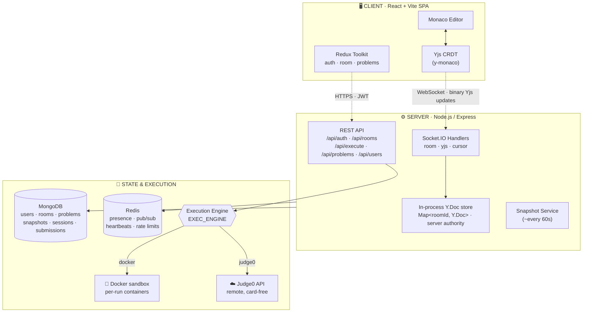
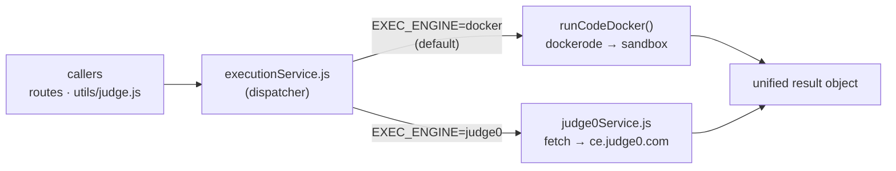
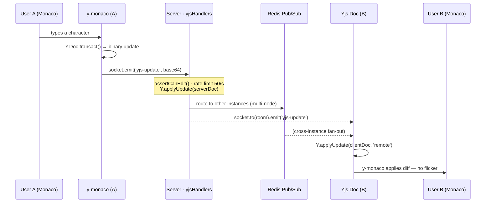
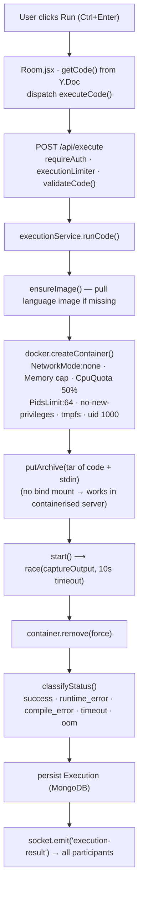
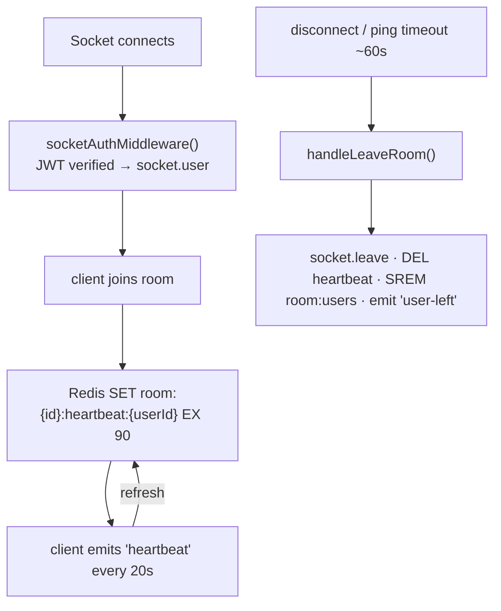
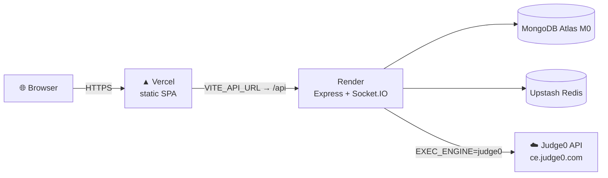
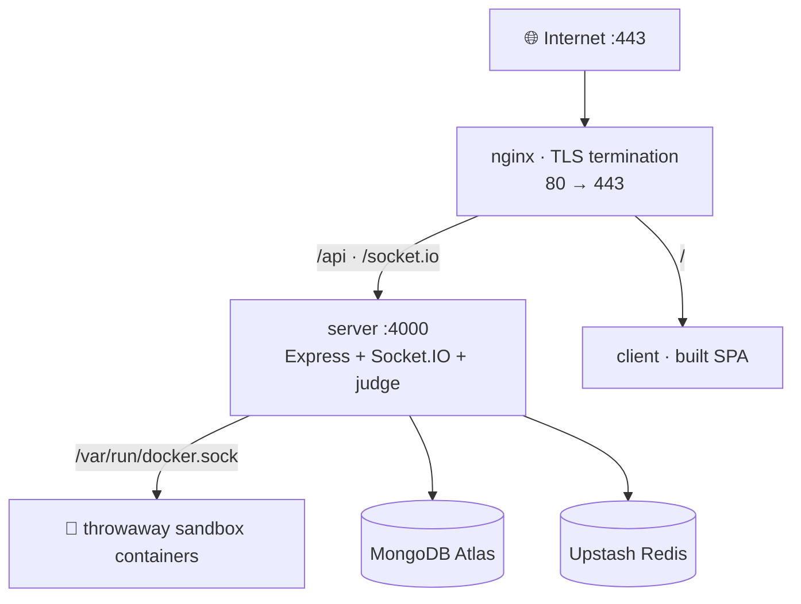

<a name="top"></a>

<div align="center">

# 🏛️ CodeSync — Architecture Reference

**A distributed, real‑time collaborative coding platform**
Multi‑cursor editing · CRDT conflict resolution · sandboxed multi‑language execution · session replay

<br/>


<br/>

📚 **Docs:** [Architecture](ARCHITECTURE.md) · [Card‑free Deploy (Judge0)](DEPLOY_JUDGE0.md) · [VM / Self‑host Deploy](PRODUCTION_DEPLOYMENT.md)

</div>

---

## 📑 Table of Contents

- [System Overview](#-system-overview)
- [High‑Level Architecture](#-high-level-architecture)
- [Pluggable Execution Engine](#-pluggable-execution-engine-the-key-design)
- [Collaboration Data Flow](#-collaboration-data-flow)
- [Code Execution Flow](#-code-execution-flow-docker-engine)
- [Practice & Interview Judge](#-practice--interview-judge)
- [Permission Model](#-permission-model)
- [Presence & Heartbeat](#-presence--heartbeat)
- [Session Replay](#-session-replay)
- [Docker Sandbox Security](#-docker-sandbox-security)
- [Redis Usage](#-redis-usage)
- [Deployment Topologies](#-deployment-topologies)
- [Tech Stack Summary](#-tech-stack-summary)
- [Scaling Path](#-scaling-path)

---

## 🧭 System Overview

CodeSync is a distributed real‑time collaborative coding platform. Multiple users
edit the same document simultaneously with **CRDT‑based conflict resolution**, see
each other's **live cursors and selections**, **run code in 7 languages**, practice
**DSA problems against a hidden‑test judge**, conduct **timed interviews**, and
**replay** a whole session frame‑by‑frame.

A single design decision shapes the whole system — **how untrusted code runs is
pluggable**:

| Engine | `EXEC_ENGINE` | Isolation | Needs a Docker host? | Used for |
|:-------|:-------------:|:----------|:--------------------:|:---------|
| **Docker** *(default)* | `docker` | One throwaway, network‑isolated container per run | ✅ yes | Local dev & self‑hosted VM — strongest isolation |
| **Judge0** | `judge0` | Remote Judge0 API (keyless or self‑hosted) | ❌ no | Card‑free PaaS deploy (Vercel + Render) |

> Both engines implement the **same `runCode` contract**, so every caller — the
> `/api/execute` route, the practice judge, and the interview judge — is completely
> engine‑agnostic. Switching engines is a one‑line env change with **zero code
> changes**.

---

## 🗺️ High‑Level Architecture



**MongoDB collections** — `User` (auth, stats, `solvedProblems`, `streak`),
`Room` (roster, interview config, hidden `testCases`), `Snapshot` (Yjs state +
plaintext), `Execution` (run log), `SessionEvent` (replay timeline + Yjs
checkpoints, 30‑day TTL), `Submission` (per‑room & per‑problem solution history,
90‑day TTL), `Problem` (seeded practice catalog + hidden tests).

---

## 🔌 Pluggable Execution Engine (the key design)

All code execution flows through one module — `server/src/services/executionService.js` —
which acts as a **dispatcher**. It reads `EXEC_ENGINE` once at boot and re‑exports
the chosen engine's functions:



### The shared contract

Both engines expose the **identical** interface:

```ts
runCode({ language, code, stdin = '' }) → {
  stdout, stderr,
  exitCode,
  executionTimeMs,
  status,                 // success | error | timeout | oom | compile_error | runtime_error
  stdoutTruncated?, stderrTruncated?
}

prewarmImages()            // docker: pull images · judge0: no-op
getActiveContainerCount()  // docker: live containers · judge0: in-flight requests
```

### Supported languages

| Language | Docker image | Judge0 ID |
|:---------|:-------------|:---------:|
| JavaScript | `node:20-alpine` | `63` |
| TypeScript | `codesync-ts:latest` *(locally built)* | `74` |
| Python | `python:3.12-alpine` | `71` |
| C++ | `gcc:13` | `54` |
| Java | `eclipse-temurin:21-jdk` | `62` |
| Go | `golang:1.22-alpine` | `60` |
| Rust | `rust:1.78-slim` | `73` |

> Any Judge0 language ID can be overridden per‑language with
> `JUDGE0_LANG_<KEY>` (e.g. `JUDGE0_LANG_PYTHON=71`) when pointing at a
> self‑hosted instance whose IDs differ from the public `ce.judge0.com`.

>
> An earlier prototype also had a **Piston** engine. The public Piston API became
> whitelist‑only in Feb 2026, so it was **removed entirely** — the two engines
> above are the only ones in the codebase.

---

## 🔄 Collaboration Data Flow

How a single keystroke travels from **User A** to **User B**:



The server keeps **one authoritative `Y.Doc` per room** in memory. New joiners
receive `Y.encodeStateAsUpdate(serverDoc)` as base64 on `room-joined`, so they
start from the exact current content with zero round‑trips.

---

## ⚡ Code Execution Flow (Docker engine)



> [!NOTE]
> **Docker‑in‑Docker note.** The server reaches the host daemon through the
> mounted `/var/run/docker.sock`. A bind‑mounted host path would be resolved by
> the *host* daemon (not the server container), so source is shipped into each
> sandbox with **`putArchive`** (an in‑memory tar) — making execution behave
> identically on bare metal or inside a container.
>
> When `EXEC_ENGINE=judge0`, this entire flow collapses to a single base64 HTTPS
> request to the Judge0 API, which returns the same unified result object.

---

## ⚖️ Practice & Interview Judge

Both **practice problems** (`POST /api/problems/:slug/submit`) and **interview
hidden tests** (`POST /api/rooms/:id/submit`) share one judge —
`server/src/utils/judge.js` — built on the engine‑agnostic `runCode`:

```text
judge({ language, code, tests })
  • for each test:  runCode({ stdin: test.input })
  • verdictFor(run, expected):
        timeout        → Time Limit Exceeded
        oom            → Memory Limit Exceeded
        compile_error  → Compilation Error
        exit ≠ 0       → Runtime Error
        output ≠ exp   → Wrong Answer          (whitespace-trimmed compare)
        output = exp   → Accepted
  • stops at the FIRST failure (a compile error fails all)
  → { accepted, passed, total, firstFailureIndex, results[] }
```

A practice **Accepted** updates the user's `solvedProblems`,
`stats.solvedByDifficulty`, and daily `streak`. The leaderboard ranks by a
difficulty‑weighted score (**Easy ×1 · Medium ×3 · Hard ×5**). Problems are
auto‑seeded on first boot (`server/src/seed/problems.js`, idempotent).

> Hidden test inputs/expected outputs are **never** sent to clients — they are
> stripped in `toJSON` and in every non‑owner route. Only pass/fail verdicts and
> the test **count** are exposed.

---

## 🔐 Permission Model

```text
Role Hierarchy:   Owner  >  Editor  >  Viewer
```

| Action | 👑 Owner | ✏️ Editor | 👁️ Viewer |
|:-------|:-------:|:--------:|:--------:|
| View code (read‑only) | ✅ | ✅ | ✅ |
| Edit code (Yjs updates) | ✅ | ✅ | ❌ |
| Send chat messages | ✅ | ✅ | ❌ |
| Execute code | ✅ | ✅ | ❌ |
| Change language | ✅ | ❌ | ❌ |
| Toggle interview mode | ✅ | ❌ | ❌ |
| Assign member roles | ✅ | ❌ | ❌ |
| Delete room | ✅ | ❌ | ❌ |
| View cursors | ✅ | ✅ | ✅ |
| View session replay | ✅ | ✅ | ✅ |

<details>
<summary><b>How a role is resolved on join</b></summary>

```text
1. userId === room.owner          → 'owner'
2. userId in room.members[]        → member.role
3. Public room + not in list       → 'editor'  (default)
4. Private room + not in list      → null       (deny entry)
5. Private room + valid password   → 'editor'
```

</details>

---

## 📡 Presence & Heartbeat



If a client crashes without a clean disconnect, its **90‑second TTL key expires
automatically** — presence garbage‑collects itself with zero polling.

---

## 🎬 Session Replay

Every significant room event is appended to the `SessionEvent` collection:

```text
Events:  join · leave · execute · language_change · chat
         interview_start · interview_end · snapshot
         yjs_checkpoint   (every 5s of active editing)

GET /api/rooms/:roomId/replay?includeCode=true
   → sorted SessionEvent[]
       ├─ non-code events  → join/leave/execute timeline
       └─ yjs_checkpoint   → base64 Yjs states, replayed in sequence
                             to reconstruct the editing session

Storage:  auto-expired after 30 days (MongoDB TTL index)
Pruning:  max 200 checkpoints per room
```

> [!CAUTION]
> **A bug worth remembering:** with Mongoose `.lean()`, `Buffer` fields return as
> BSON `Binary`, and `Buffer.from(Binary)` silently yields an *empty* buffer — so
> the client dropped every checkpoint ("no checkpoints"). The fix is a
> `bufferToBase64()` helper that handles Node `Buffer`, BSON `Binary` (`.buffer`),
> and raw bytes.

---

## 🛡️ Docker Sandbox Security

The Docker engine hardens untrusted execution in **five layers**:

| Layer | Control | Effect |
|:------|:--------|:-------|
| **1 · Network** | `NetworkMode: 'none'` | No outbound connections — no exfiltration, no internal access |
| **2 · Resources** | `Memory`+`MemorySwap` cap (256 MB, swap off) · `CpuQuota` 50% · `PidsLimit: 64` | No memory blowups, CPU hogging, or fork bombs |
| **3 · Filesystem** | source via `putArchive` (no bind mount) · writable only on tmpfs `/tmp` (noexec) + `/build` (exec) · container removed after run | No host filesystem reach; binaries run only from `/build` |
| **4 · Privilege** | `User: '1000'` (non‑root) · `no-new-privileges:true` | No privilege escalation |
| **5 · Application** | 10 s wall‑clock TLE · stdout cap 1 MB · stderr cap 256 KB · code size 100 KB | Infinite loops killed; print floods can't exhaust RAM |

> [!WARNING]
> **Known trade‑off:** `docker.sock` is mounted for container management. If the
> execution service were compromised, an attacker could reach the Docker API.
> For production hardening, run execution on a **dedicated node** or use
> **Firecracker / gVisor / Kata Containers** for VM‑level isolation. The
> **Judge0 engine sidesteps this entirely** by running code off‑box.

---

## 🧮 Redis Usage

| Key pattern | Purpose | TTL |
|:------------|:--------|:----|
| `room:{id}:users` | Active user set | 24h |
| `room:{id}:meta` | Language, name | 24h |
| `room:{id}:cursors` | Cursor positions | 24h |
| `room:{id}:heartbeat:{userId}` | Presence TTL | 90s |

Pub/Sub via `@socket.io/redis-adapter` enables horizontal scaling: when
`io.to(roomId).emit()` fires on **Server A**, Redis routes it to **Server B**'s
sockets automatically — **zero code change**.

---

## 🚀 Deployment Topologies

CodeSync ships with **two first‑class deployment paths**, selected by `EXEC_ENGINE`.

### A · Card‑free PaaS (`EXEC_ENGINE=judge0`)

Zero credit card, $0/month. Execution is remote, so no Docker host is needed.



➡ Full walkthrough: **[DEPLOY_JUDGE0.md](DEPLOY_JUDGE0.md)**

### B · Self‑hosted VM (`EXEC_ENGINE=docker`)

Strongest isolation — the real per‑run Docker sandbox — on a single Linux VM.



➡ Full walkthrough: **[PRODUCTION_DEPLOYMENT.md](PRODUCTION_DEPLOYMENT.md)**

> [!TIP]
> The same image and codebase runs both ways. You can deploy card‑free **now**
> with Judge0, then later move execution to a self‑hosted Docker node for stronger
> isolation — flipping a single env var, no code changes.

---

## 🧰 Tech Stack Summary

| Layer | Technology | Why |
|:------|:-----------|:----|
| Frontend | React 18, Redux Toolkit, Vite | Fast DX, predictable state |
| Editor | Monaco Editor (VS Code core) | Industry‑standard, rich language support |
| CRDT | Yjs + y‑monaco | Conflict‑free merging, offline‑safe |
| Transport | Socket.IO (WebSocket + polling) | Auto‑reconnect, rooms, adapters |
| Backend | Node.js + Express (ESM) | Non‑blocking I/O, npm ecosystem |
| Auth | JWT access + refresh tokens | Stateless, scalable |
| Primary DB | MongoDB + Mongoose 8 | Flexible schema for rooms/sessions |
| Cache / PubSub | Redis (ioredis) | Presence, adapter, fast key‑value |
| Execution (default) | Dockerode + Docker Engine | Language‑agnostic, hardened sandbox |
| Execution (PaaS) | Judge0 API (`fetch`) | Card‑free, no Docker host required |
| Reverse proxy (VM) | nginx | TLS termination, WebSocket upgrade |
| Hosting (PaaS) | Vercel + Render + Atlas + Upstash | No credit card |

---

## 📈 Scaling Path

A single server comfortably handles **~50 concurrent rooms**. To scale further:

1. **Horizontal API scaling** — already supported via the Redis adapter; add Node
   instances behind nginx with zero code change.
2. **Execution isolation** — move Docker execution to dedicated worker VMs with a
   job queue (BullMQ), **or** scale out with Judge0 (self‑hosted cluster).
3. **MongoDB Atlas** — swap the connection string for managed replication.
4. **Redis Cluster** — for very high presence volume (>10k connections).

Deliberately **not** added (over‑engineering risk): Kubernetes, Kafka, GraphQL,
CQRS, Event Sourcing, Microservices.

---

<div align="center">

**CodeSync** · Architecture Reference
[⬆ Back to top](#top)

</div>
